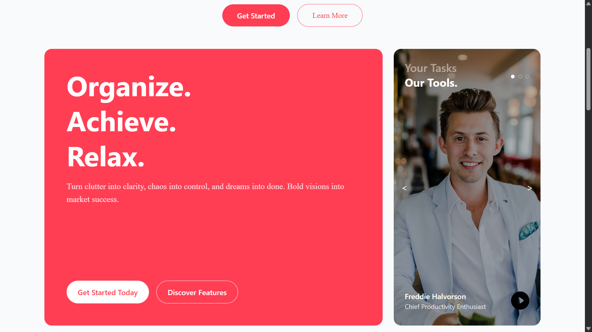
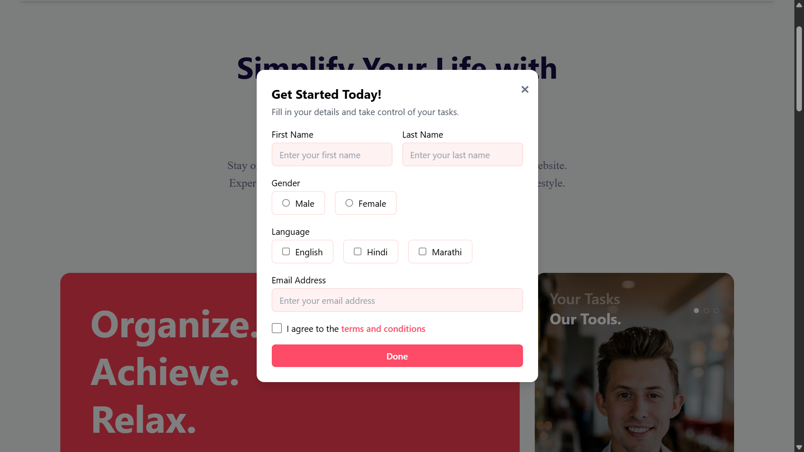
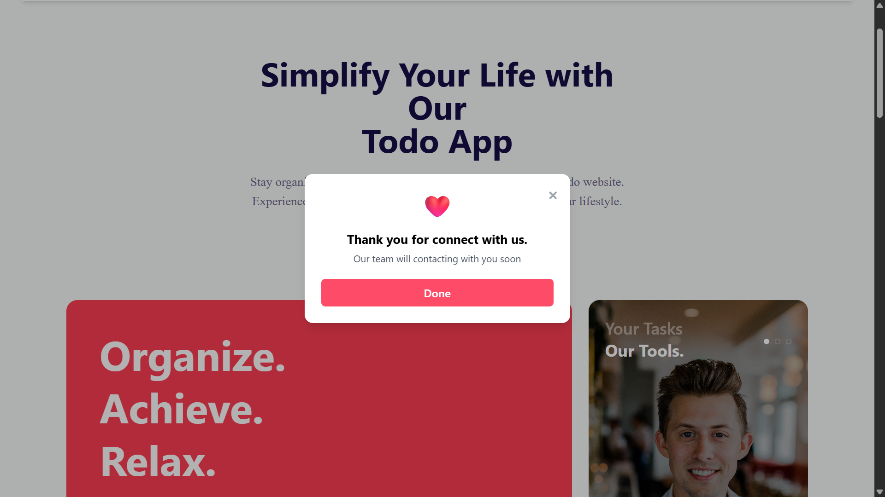
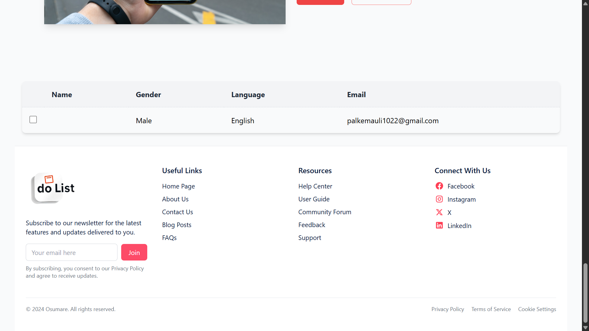

# React Form Modal Component

React Form Modal is a responsive, customizable modal form built with React and Tailwind CSS.  
It allows users to input personal details like name, gender, language preferences, and email in a clean, user-friendly interface. The form supports multi-language selection and includes validation features like agreement to terms and conditions.

---

## Key Features

- Responsive design for all screen sizes  
- Controlled form inputs including text fields, radio buttons, and checkboxes  
- Multi-language selection with checkboxes  
- Close modal button for easy dismissal  
- Simple integration into any React project  

---

## Technologies Used

- **Frontend:** React.js, Tailwind CSS  
- **State Management:** React `useState` Hook  

---

## Getting Started

### 1. Clone the repository

```bash
git clone https://github.com/yourusername/react-form-modal.git
```

##  Sample Screen Shots







